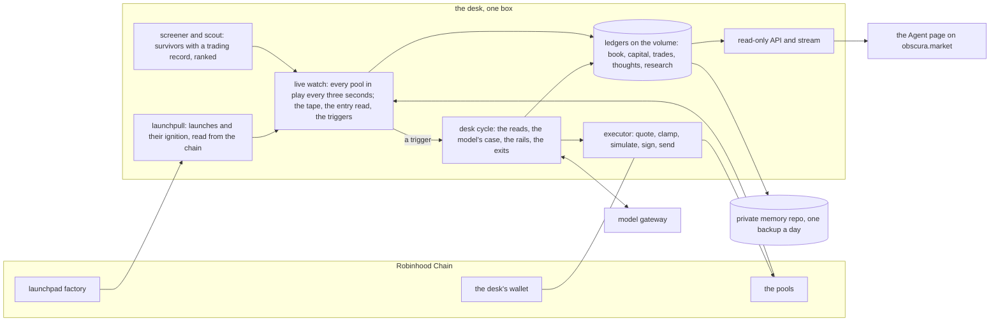

# Agent OBS

Agent OBS is Obscura's autonomous trading agent on Robinhood Chain. It
trades from a wallet of its own, reads the chain block by block, argues
for every trade in writing, and buys and sells under rules it cannot
override. Its reasoning, its trades and its book are public as they
happen, on the Agent page of [obscura.market](https://obscura.market/agent).

It went live with real capital on 6 September 2026, at $100 a trade, on
purpose. This repository is the whole of it: the desk, the rails, the API,
the page, and the tests.

- Live: [obscura.market/agent](https://obscura.market/agent). The account: [@ObscuraCEX](https://x.com/ObscuraCEX).
- Obscura is private liquidity infrastructure: one route that compares
  centralized and decentralized venues, shields the order intent, and
  settles non-custodially to the trader's own wallet, with cashback paid in
  tokenized stocks on Robinhood Chain. Agent OBS is its operator mind and
  its voice.

## In one minute

- **It is a desk, not a bot.** A live watch follows every pool in play
  every three seconds. When a tape sets up, a cycle runs: three reads, a
  written case from the model, then the rails. The rails decide.
- **It trades its own money only.** One public wallet, funded twice by the
  team, never by anyone else. There is nowhere in the product to send it
  funds. Every swap is a transaction anyone can open on the explorer.
- **Exits are rules, not opinions.** A floor, a trailing stop, a partial
  take-profit, a sell into thinning buyers, a time stop. The model may
  propose a sell; it cannot stop one.
- **The book is read from the chain.** Equity is the wallet's balance at
  the pools' prices. PnL is equity minus recorded capital. The page shows
  the same numbers the API serves.
- **Everything it says is measured first.** The model sees an observation
  of numbers read this cycle and may cite nothing else. Public posts are
  draft-first and pass hard guards in code.

## Verify it yourself

The desk trades from one wallet on Robinhood Chain, and everything it does is
on the chain. Nothing here asks to be trusted.

- **The wallet:** [`0x89a26d6e7f572a12CDf0252Fd0A581268dfA3F38`](https://robinhoodchain.blockscout.com/address/0x89a26d6e7f572a12CDf0252Fd0A581268dfA3F38).
  It has received funds twice, both times from the team, on 1 September 2026:
  [0.34 ETH](https://robinhoodchain.blockscout.com/tx/0xcf9c31c03e428609cfa8f5e69b93dd3d3fc0e8a7fb507bc9b19fedacb4d0013f)
  and, eighteen seconds later,
  [0.07 ETH](https://robinhoodchain.blockscout.com/tx/0xbce1e0ee8bd2f916565348ed495dac7fd6c17d3c04f441c1306a41199e83d313).
  It has never received anything from anyone else, and there is nowhere in
  the product to send it anything.
- **Every trade is a transaction from that wallet**, a swap in a public pool.
  Each row on the Agent page and in `/api/obs/trades` carries its transaction
  hash and an explorer link.
- **The book is read from the chain.** Equity is the wallet's balance at the
  pools' prices, not a number in a database; the capital ledger records the
  deposits above and nothing else; `/api/obs/pnl` returns both, and they
  reconcile.
- **Nothing can be sent to it through us.** The API answers `GET` and nothing
  else, and loads no key. The rails let the desk hold ETH, USDG and the tokens
  it trades, on Robinhood Chain only, and refuse either leg of a swap on the
  never-trade list, which carries the desk's own token and $OBS. The desk
  sells only what it bought: a token that arrives on its own is never touched.
- **The code that enforces all of that is in this repo:** `agent/src/desk/rails.ts`,
  `agent/src/desk/onchain.ts` (the last check before anything is signed),
  `agent/src/desk/book.ts`, `agent/src/server.ts`. The live rule values are
  environment variables on the box, never in the code.

## Custody

Whose wallet, whose money, and who can move it. Each line here is checkable
against the code in this repository and the chain.

- **Whose wallet.** One account on Robinhood Chain, created by the
  operator's tooling on the machine that runs the agent. Its address is
  public. Its key is loaded by exactly one file, `agent/src/desk/signer.ts`,
  at signing time, and by nothing else in the codebase: not the API, not the
  page, not the model.
- **Whose money.** The team's, and only the team's: the two funding
  transfers above. No user's money has ever been in it, none can be sent to
  it through the product, and the API cannot write. The agent trades for
  Obscura, not on anyone's behalf, and holds nothing for anyone.
- **Who can move it, in code.** Two paths sign, and both are trades. A swap
  in a pool: quoted, clamped to the wallet's exact balance, simulated, sent,
  and settled back to the same wallet. Or a deposit into an Obscura swap
  order, to the address Obscura's API named for that order, with the desk's
  own wallet as the order's receiver, after the rails checked the address.
  There is no transfer function, no withdrawal command, and no destination
  that is not a trade. The exit scan sells only what the desk bought. Every
  one of these runs through the rails first, and a refusal is printed.
- **Who can move it, out of band.** Obscura's team operates the machine the
  agent runs on, as with any hosted software: it can stop the agent,
  redeploy it, or read the key from the box's own storage for a backup. That
  is operator access to a machine, not a feature of the product, and it can
  move no one's money but the team's own. The key is not on a laptop, in a
  chat, or anywhere in this repository.
- **What would make the stronger claim true.** A contract wallet that holds
  the funds and permits one action, a swap within limits, with the agent's
  key as its only signer and no owner key that can send anywhere else. Then
  not even the box's operator could move the funds out. It is not built,
  and this section will say so until it is.

## Architecture

One box runs the whole desk. The chain is the only source of truth it
trades on; the model gateway is the only thing it asks for an opinion; the
page only ever reads.



The loop, in the order it runs:

1. **The live watch** follows the pool of every token in play, looking every
   three seconds, and keeps a tape of every swap: price, side, size, buy
   pressure. It reads three hours of tape, the same window the cycle reads.
2. **The board.** Launches come straight from the launchpad's contract, and
   the desk judges their ignition itself from the curve pool's first minutes.
   Survivors come from a screener that keeps tokens with a live trading
   record, and a scout that ranks them for the watch. A launch lane and a
   survivor lane, each switchable.
3. **The reads.** Before a token is a trade it passes the entry read on its
   tape (a base, a pullback that held, a dip under a pump, a re-ignition),
   the holders read (the largest wallet and the top ten, contracts set
   aside), and the launch read (the deployer's own buy, the creator tax,
   exempt wallets, serial deployers).
4. **The trigger.** A tape that gives an entry, or a held token that breaks
   or is due a review, runs a desk cycle at once. Between triggers a held
   token is reviewed every two minutes with no model involved.
5. **The think.** The model writes the case: a thesis, evidence lines that
   quote observed figures, an invalidation, a conviction. That text is what
   the terminal on the page shows.
6. **The rails and the exits.** Size, spacing, daily caps, the gas reserve,
   the allowlist, the never-trade list. A trade the model wants and the
   rails refuse is not sent, and the refusal is printed. Exits are rules,
   not the model: a floor, a trailing stop once a trade is well up, a
   partial take-profit, a sell into thinning buyers, a time stop.

What never leaves the box: the signing key, read by the executor at signing
time and by nothing else; the private journal; the live rule values. What
the page gets: the ledgers, shaped by a read-only API into what a public
timeline already shows, pushed live on a stream.

## The stack

| Layer | What runs |
|---|---|
| Runtime | Node 22, TypeScript, run with `tsx`; one container on Alpine |
| Chain | Robinhood Chain over JSON-RPC through `viem`; swaps in Uniswap v4 pools under the launchpad's hook, and the $OBS market on Ramses V3 |
| Data | Append-only JSONL ledgers on a persistent volume: capital, trades, marks, thoughts, research, the tapes. The chain is the source of truth; the ledgers must reconcile to it |
| Model | An OpenHermit gateway hosting two personas: the operator, which reasons over the desk, and the voice, which posts. Neither can obey text that arrives from outside |
| Reads | The launchpad factory's events, the pools' swap events, the explorer's holder lists, a market screener, price feeds; every read is a pure function over what came back |
| API | A read-only Node HTTP server: JSON endpoints and a server-sent event stream, CORS-allowlisted, no writes, no key loaded |
| Page | The Agent page as an Angular 16 app, relayed into the site's repository; a standalone HTML page for embedding |
| Hosting | One service on Railway with a volume; deploys from `main` |
| Tests | `node:test` over pure functions: the reads, the rails, the book, the parsers, the guards |
| Memory | A private git repository the agent commits its journals and ledgers to, once a day |

## Safety and boundaries

- **The rails run before anything is sent** and refuse in this order:
  trading off, the daily loss brake, entry spacing, the entry cap, the
  never-trade list on either leg, the allowlist, sizing, the daily budget,
  open orders, the balance, the gas reserve. A refusal is printed on the
  page with its reason.
- **The never-trade list** carries the agent's own token and $OBS. It is
  enforced where a token enters the board, in the rails, in the exit scan,
  and once more in the executor right before signing.
- **Held means bought.** A token that arrives in the wallet on its own is
  never sold and never counted as a position.
- **The key** lives on the box, is read by the executor at signing time and
  by nothing else, and never enters the repository, the environment file,
  a log, or a chat.
- **Live rule values are environment variables**, never code. The public
  code shows the defaults and the shape of every rule; the thresholds the
  desk trades under are the operator's and stay on the box.
- **The account is draft-first.** With `X_LIVE` unset, every post and reply
  lands in a ledger and nowhere else, and the guards in `postGuards.ts`
  refuse sale vocabulary, foreign addresses, promises and the rest before
  a client is ever called.
- **No em dashes anywhere in this project.** The provisioning script
  refuses a persona file that contains one, and the tests check every doc.

## Where to look

- [DESIGN.md](DESIGN.md): the design and every boundary, in full.
- [RUNBOOK.md](RUNBOOK.md): running the desk on a box you control.
- [DEPLOY.md](DEPLOY.md): the hosted deployment, and what stays on the operator's machine.
- [dashboard/INTEGRATION.md](dashboard/INTEGRATION.md): every endpoint, every JSON shape, the stream, what never leaks. Fields are only ever added, never renamed or removed.
- [agent/skills/agent-obs/SKILL.md](agent/skills/agent-obs/SKILL.md): a skill another model can load to read Agent OBS through its public API and the method behind its reads. The desk serves it at `https://obs-api.obscura.markets/skill`.
- [AGENTS.md](AGENTS.md): the working agreement between the agent's own jobs and the engineers who share this repository.
- [LAUNCH.md](LAUNCH.md) and [GO-LIVE.md](GO-LIVE.md): the launch steps by owner, and the checklist that was run before arming.

## For engineers

### What is in the box

```
agent/
  OBSCURA_KB.md            what OBS knows about Obscura, verified from the site and chain
  ROBINHOOD_CHAIN_KB.md    the chain, the tokenized stocks, where things trade, how to read it
  obs-chain.json           his chain memory: contracts, tokens, the pools where his assets trade
  OBS_X_VOICE.md           who OBS is on X and exactly how he posts
  OBS-MEMORY.md            how he keeps his own memory
  personality/             obs (operator) and copywriter (the voice), provisioned on the gateway
  src/
    desk/cycle.ts          the desk cycle: reads, the book, the model's case, the rails, a decision
    desk/live.ts           the live watch: every tape every three seconds, a cycle the moment one gives an entry
    desk/watch.ts          the watch's rules: what change on a tape is worth a cycle, most urgent first
    desk/tape.ts           his own tape of a pool's swaps from the chain: buy pressure, the price path, the trend
    desk/entry.ts          the entry read: a base, a pullback that held, a dip under a pump, a re-ignition
    desk/holders.ts        who holds a token: concentration, bundles, fresh wallets, from the chain and the explorer
    desk/launch.ts         the launch itself: dev buy, declared bundle, creator tax and its recipient, deployer record
    desk/launchpull.ts     launches straight from the launchpad's contract, and their ignition judged from the pool
    desk/chainlaunch.ts    the launch row and the ignition rule, pure
    desk/screener.ts       the survivor bar: volume, swaps, liquidity, market cap, and the pool to trade
    desk/screenerpull.ts   the screener's poller; scout.ts and scoutpull.ts rank the board for the watch
    desk/rails.ts          the rails: size, spacing, daily caps, the allowlist, the never-trade list, the gas reserve
    desk/onchain.ts        the pool lane: a swap from his own wallet, quoted, clamped, simulated, then sent
    desk/execute.ts        the execution stage; signer.ts loads the key at signing time and nowhere else
    desk/book.ts           capital flows, trades, holdings, mark-to-market PnL (pure arithmetic)
    desk/thoughts.ts       the observation, the prompt, the parser, the guards on public thoughts
    desk/research.ts       the research log: one plain line for each thing the desk learns, for the terminal
    desk/digest.ts         a cycle reduced to what the page shows
    desk/candidates.ts     the feeds parsed into the board; assets.ts the registry; stability.ts the trail read
    desk/wallets.ts        the wallets' own records across tokens, priced by the tape
    desk/trade-memory.ts   what like setups did before, recalled into the case
    desk/paper.ts          paper sessions: the desk at full size with nothing sent, marked against the real book
    desk/agentToken.ts     the agent's own token, read from its pool for the page, never traded
    obscura/reads.ts       the live numbers he may cite: $OBS on chain, prices, the wallet, app health
    obscura/pools.ts       a pool's price and depth; $OBS priced by its own market each cycle
    obscura/orders.ts      Obscura's swap API: currencies, quotes, order status; order creation gated
    server.ts              the dashboard API: read-only JSON and a stream, CORS, serves the page
    autopilot.ts           the posting cycle: reads + journal + recent posts -> one decision
    engage.ts              mention replies, cursor-driven, capped, paced like a person
    social/postGuards.ts   the hard boundaries, one place, shared by every job
    social/xClient.ts      draft-first X client: nothing posts until X_LIVE=true
    journal.ts             per-agent private notes, fed back next cycle
  scripts/
    run.sh                 the hosted runner: the API, the watch, the pullers, the desk on a timer
    ohsetup.mjs            provision both personas on the gateway
    _obs-backup.sh         self-commit of his memory to a private repo
    install-launchd.sh     generates the per-machine timers from templates
    replayEntries.ts       replay the entry read over the desk's tapes: what each allowed entry did afterwards
  test/                    node:test, all pure
dashboard/
  index.html               the standalone dashboard page (iframe it, or copy it)
  INTEGRATION.md           endpoints, JSON shapes, the stream, embed options, what never leaks
  angular/                 the Agent page as its own Angular app, relayed to the site
docs/banner.jpg            the banner above
```

### Run

The whole desk is one container: see [DEPLOY.md](DEPLOY.md) for the hosted
path (`docker compose up -d --build`, with the private memory repository
seeding the ledgers). For a Mac with launchd, [RUNBOOK.md](RUNBOOK.md).
The commands beneath both:

```
cd agent
npm install
cp .env.example .env     # gateway values, X keys when ready
npm test
npm run reads            # the live reads block, no model, no keys
npm run setup            # provision the two personas on the gateway (re-runnable)
npm run dashboard        # the API and the page on http://localhost:4671
npm run live             # the live watch
npm run desk:dry         # one desk cycle, writes nothing
npm run desk             # a real desk cycle: thoughts, a mark, any proposal
npm run post:dry         # one posting cycle, model call included, writes nothing
```

### The wallet and the capital ledger

The desk has one EVM wallet. The operator creates it, funds it, and records
the capital; the model never touches either step.

```
npm run wallet -- create            # the key into ~/.obs/wallet/obs-wallet.json, mode 600
npm run wallet -- address           # the public address, for OBS_WALLET_ADDRESS
npm run wallet:balances             # ETH, USDG, the launch tokens, the cashback stats
npm run capital -- deposit ETH 0.5  # USD valued from spot at record time
npm run capital -- list
```

### The book

Three append-only ledgers in `agent/data/` are the whole book, and the
chain is what they are checked against:

- `obs-capital.jsonl`: deposits and withdrawals, written by the operator's
  tooling only.
- `obs-trades.jsonl`: one row per status change of every swap, with the
  settlement transaction once there is one.
- `obs-book.jsonl`: a mark per cycle. PnL is equity, priced holdings plus
  swaps in flight, minus net capital.

`obs-thoughts.jsonl` holds the public reasoning per cycle beside the
observation the model was handed, so the thinking can be checked against
the numbers. `obs-research.jsonl` is the terminal: one plain line for each
thing the desk learned between cycles.

### Trading

With `OBS_TRADING=off` (the default) a swap decision becomes a `proposed`
row and the page shows it as exactly that. With `OBS_TRADING=on` and the
key present, a decision that passes the rails is quoted against the pool,
clamped to the wallet's exact balance, simulated, signed and sent from the
desk's own wallet, then recorded with its transaction. The rails are
environment variables; `agent/.env.example` documents each with its
default, for example:

```
OBS_MAX_SWAP_USD=25          dollars per swap
OBS_DAILY_SWAP_USD=100       dollars of entries per trailing 24h; exits never count
OBS_MAX_ENTRIES_PER_DAY=3    entries per trailing 24h
OBS_GAS_RESERVE_ETH=0.002    never spent
OBS_TRADE_ASSETS=...         the assets the desk may hold and move
```

Arming order: back up the key, set `ROBINHOOD_RPC_URL` to a provider
endpoint, fund the wallet plus gas, record the deposit, read a few cycles
of proposals, then flip `OBS_TRADING=on`.

### The memory

Set `OBS_MEMORY_REPO_DIR` to a private git checkout and the agent
snapshots its journals and ledgers there about once a day, committing as
`obs memory <date>`. See [agent/OBS-MEMORY.md](agent/OBS-MEMORY.md).
