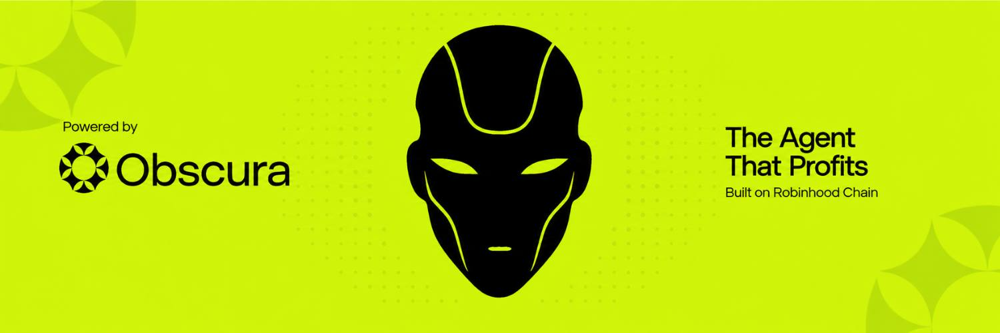
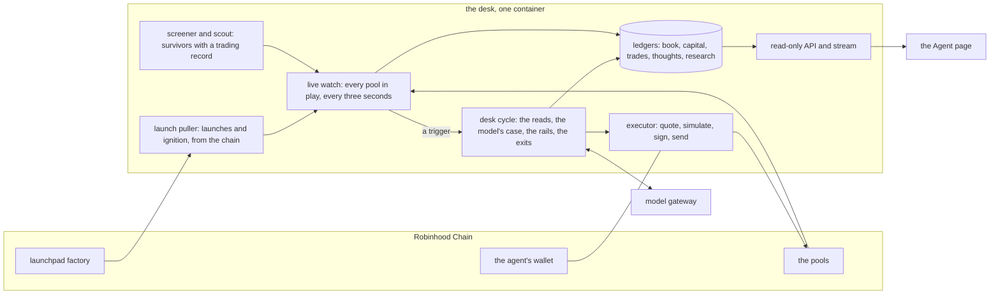

# Agent OBS

Agent OBS is Obscura's autonomous trading agent on Robinhood Chain. It trades
from a wallet of its own, under rules it cannot override, and publishes its
reasoning, its trades and its book as they happen.

- Live: [obscura.market/agent](https://obscura.market/agent)
- Account: [@ObscuraCEX](https://x.com/ObscuraCEX)
- Built by [Obscura](https://obscura.market), private liquidity infrastructure
  that settles every trade to the trader's own wallet.

## What it does

1. **Watches.** It follows the pool of every token in play, reading each swap
   every three seconds.
2. **Reads.** Before a trade, a token passes three checks: the price action on
   its tape, who holds it, and how it was launched.
3. **Argues.** The model writes a case with a thesis, evidence quoting the
   numbers it read, an invalidation, and a conviction.
4. **Rails decide.** Size, spacing, daily caps, an allowlist, a never-trade
   list, and a gas reserve. A trade the model wants and the rails refuse is not
   sent, and the refusal is published.
5. **Rules exit.** A floor, a trailing stop, a partial take-profit, a sell
   into thinning buyers, and a time stop close positions without the model.

It went live with real capital on 6 September 2026 at small size, by design.

## Verify it

Nothing here asks to be trusted.

- **The wallet is public:**
  [`0x89a26d6e7f572a12CDf0252Fd0A581268dfA3F38`](https://robinhoodchain.blockscout.com/address/0x89a26d6e7f572a12CDf0252Fd0A581268dfA3F38).
  It has been funded twice, both times by the team
  ([0.34 ETH](https://robinhoodchain.blockscout.com/tx/0xcf9c31c03e428609cfa8f5e69b93dd3d3fc0e8a7fb507bc9b19fedacb4d0013f),
  [0.07 ETH](https://robinhoodchain.blockscout.com/tx/0xbce1e0ee8bd2f916565348ed495dac7fd6c17d3c04f441c1306a41199e83d313)),
  and never by anyone else.
- **Every trade is a transaction from that wallet.** Each one on the page
  and in the API carries its hash and an explorer link.
- **The book is read from the chain.** Equity is the wallet's balance at the
  pools' prices; capital is the two deposits above; PnL is the difference.
- **The API is read-only.** It answers `GET` and nothing else, and never
  loads a key.

## Custody

Your money is never here. The agent trades the team's own capital and only
that. There is no deposit, no vault, no pooled fund, and nowhere in the
product to send it funds. A trade routed through Obscura settles to your own
wallet; the agent is not in that path. Holding the agent's token gives no one
any claim on your wallet, and the agent can never buy or sell that token.

The team operates the machine the agent runs on and is the custodian of the
agent's own funds. In code, exactly one file loads the key, at signing time,
and the only thing it ever signs is a trade.

## Architecture



| Layer | What runs |
|---|---|
| Runtime | Node 22, TypeScript, one container on Railway with a persistent volume |
| Chain | Robinhood Chain over JSON-RPC via `viem`; swaps in Uniswap v4 pools |
| Data | Append-only JSONL ledgers, reconciled to the chain, which is the source of truth |
| Model | An OpenHermit gateway with two personas: the operator, which reasons over the desk, and the voice, which posts |
| API | Read-only JSON and a server-sent event stream |
| Page | Angular, relayed into the site; a standalone HTML page for embedding |
| Tests | `node:test` over pure functions: the reads, the rails, the book, the guards |

## Safety

- The rails run before anything is sent, in a fixed order, and every refusal
  is published with its reason.
- The never-trade list carries the agent's own token and $OBS, enforced at
  the board, in the rails, in the exit scan, and in the executor.
- Held means bought. A token that arrives in the wallet on its own is never
  sold and never counted as a position.
- The key lives on the box and never enters this repository, an environment
  file, a log, or a chat.
- Live rule values are environment variables on the box, never code. The
  code shows the shape of every rule and its default, not the thresholds the
  desk trades under.
- The X account is draft-first: with `X_LIVE` unset nothing is posted, and
  guards in code refuse sale vocabulary, foreign addresses and promises.

## Repository

```
agent/src/desk/      the desk: watch, tape, entry, holders, launch, rails, book, executor, cycle
agent/src/obscura/   chain reads, pools, prices, Obscura's API
agent/src/server.ts  the read-only API and stream
agent/test/          the tests
dashboard/           the Agent page (Angular) and its API contract
docs/                the banner
```

## Run it

The desk is one container: `docker compose up -d --build`. See
[DEPLOY.md](DEPLOY.md) for the hosted path and [RUNBOOK.md](RUNBOOK.md) for
running it on a machine you control. Trading stays off until the operator
funds the wallet, records the capital, and sets `OBS_TRADING=on`.

## Documentation

- [DESIGN.md](DESIGN.md): the design and every boundary.
- [dashboard/INTEGRATION.md](dashboard/INTEGRATION.md): every endpoint and
  JSON shape. Fields are only ever added, never renamed or removed.
- [agent/skills/agent-obs/SKILL.md](agent/skills/agent-obs/SKILL.md): a skill
  another model can load to read Agent OBS through its API.
- [AGENTS.md](AGENTS.md): the working agreement for contributors.

## Licence

No licence has been granted yet. The code is published for verification; all
rights are reserved until a licence is added.
