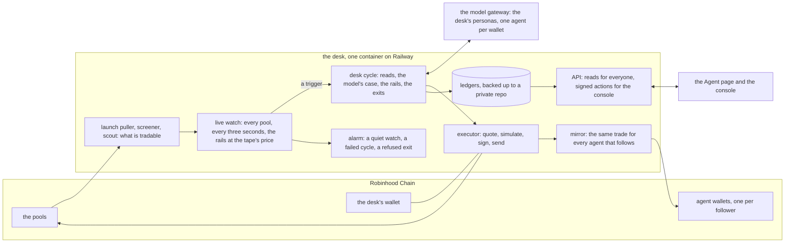

# Agent OBS

Agent OBS is Obscura's autonomous trading agent on Robinhood Chain. It trades
from a wallet of its own, under rules it cannot override, and publishes its
reasoning, its trades and its book as they happen. Invited wallets get an
agent of their own in the console that follows every trade it makes.

- Live: [obscura.market/agent](https://obscura.market/agent)
- Console: [obscura.market/console](https://obscura.market/console)
- Built by [Obscura](https://obscura.market), private liquidity infrastructure
  that settles every trade to the trader's own wallet.

## What it does

1. **Watches** every pool in play, every swap, every three seconds.
2. **Reads** a token three ways before a trade: its tape, who holds it, how it
   was launched. A count the read could not make is never handed to the
   model as one.
3. **Argues.** The model writes a case: thesis, evidence quoting the numbers
   it read, invalidation, conviction.
4. **Rails decide:** size, spacing, a gas reserve for the round trip, a cap
   per grade, an allowlist, a never-trade list. A trade the model wants and
   the rails refuse is not sent, and the refusal is published.
5. **Rules exit:** a floor, a trailing stop, a partial take-profit, a sell
   into thinning buyers, a time stop. The watch reads them at the tape's
   price, so a rail fires within seconds of the tape crossing it.

It went live with real capital on 6 September 2026 at small size, by design.

## The console

An invited wallet signs in with one signature and gets an agent tied to that
wallet: talk to it, train it, pick its model, turn it on.

- `/start` makes it follow Agent OBS trade for trade at your size, from a
  wallet made for it. `/stop` turns it off; it still sells what it holds when
  the desk does. `/size` sets what it puts into each entry.
- `/fund 0.05 ETH` sends ETH to that wallet from yours. `/withdraw all` sends
  it back, and only ever to the wallet you signed in with.
- `/agent` is its book, `/desk` the house desk, `/agents` every agent
  following the desk and what each has made.

## Verify it

- **The desk's wallet is public:**
  [`0x89a2…3F38`](https://robinhoodchain.blockscout.com/address/0x89a26d6e7f572a12CDf0252Fd0A581268dfA3F38),
  funded twice by the team
  ([0.34 ETH](https://robinhoodchain.blockscout.com/tx/0xcf9c31c03e428609cfa8f5e69b93dd3d3fc0e8a7fb507bc9b19fedacb4d0013f),
  [0.07 ETH](https://robinhoodchain.blockscout.com/tx/0xbce1e0ee8bd2f916565348ed495dac7fd6c17d3c04f441c1306a41199e83d313))
  and never by anyone else.
- **Every trade is a transaction** from that wallet, or from a follower's own
  agent wallet, with its hash and explorer link on the page and in the API.
- **The book is read from the chain.** Equity is what the wallet holds at the
  pools' prices, capital is the deposits, PnL is the difference.
- **The desk's API is read-only.** The only writes are a person's own signed
  actions in the console, and a funding or a swap counts only once the chain
  confirms it.

## Custody

The desk trades the team's capital and only that. A follower's agent trades
from a wallet made for it: funded only by the person's own wallet, withdrawn
only to that wallet, never pooled. The desk holds the key that signs for
those wallets, so an agent can follow the desk with the person offline; that
is the custody the product asks you to accept. Holding the agent's token
gives no one a claim on any wallet, and the desk can never buy or sell it.

## Architecture



| Layer | What runs |
|---|---|
| Runtime | Node 22, TypeScript, one container with a persistent volume |
| Chain | Robinhood Chain via `viem`; Uniswap v4 pools through the Universal Router |
| Data | Append-only JSONL ledgers, reconciled to the chain, which is the source of truth |
| Model | An OpenHermit gateway: the desk persona, a fast persona for entry ticks, one agent per wallet on any OpenRouter model, metered in credits |
| Site | Angular pages relayed into the site by pull request, staged on a preview before they ship |
| Tests | `node:test` over the pure rules, and a console walk that starts a real server and drives every command |

## Safety

- The rails run before anything is sent and every refusal is published.
  Exits skip every cap and brake, are never blocked, and a refused exit
  pages the operator.
- The never-trade list carries the agent's own token and $OBS, enforced at
  the board, in the rails, in the exit scan and in the executor.
- Held means bought: a token that arrives on its own is never sold and never
  a position.
- Keys never enter this repository, a log or a chat. The desk's key is read
  at signing time and checked against the desk's address first.
- Live rule values are environment variables on the box, never code.
- The alarm posts to a webhook when the watch goes quiet, a cycle fails or a
  sell is refused; the health route says `ok` or `stale` for any uptime check.
- The X account is draft-first: with `X_LIVE` unset nothing is posted.

## Repository

```
agent/src/desk/        the desk: watch, tape, entry, holders, launch, rails, book, executor, cycle,
                       and the console's side: gate, accounts, credits, userAgents, follow, mirror, agentWallet, alerts
agent/src/cli/         the console's command router, pure
agent/src/server.ts    the API, the stream and the console's effects
agent/scripts/         the container runner, the backup, the console walk
agent/test/            the tests
dashboard/             the Agent page and the console (Angular) and the API contract
scripts/               deploy the desk; relay, stage and ship the site
```

## Run it

Start with [QUICKSTART.md](QUICKSTART.md): a fresh clone to a running page,
then paper, then live. Everything answers to one command, `obs`, and the
console speaks the same commands from a browser wallet. [DEPLOY.md](DEPLOY.md)
is the hosted path. Trading stays off until the operator funds the wallet,
records the capital and sets `OBS_TRADING=on`. Every push and pull request
typechecks, tests and walks the console in `agent/` (`.github/workflows/ci.yml`),
and `scripts/deploy-desk.sh` refuses a head that does not typecheck and pass its
tests, each on its real exit code.

## Documentation

- [DESIGN.md](DESIGN.md): the design and every boundary.
- [dashboard/INTEGRATION.md](dashboard/INTEGRATION.md): every endpoint and
  JSON shape. Fields are only ever added, never renamed or removed.
- [agent/skills/agent-obs/SKILL.md](agent/skills/agent-obs/SKILL.md): a skill
  another model can load to read Agent OBS through its API.
- [AGENTS.md](AGENTS.md): the working agreement for contributors.

## Licence

No licence has been granted yet. The code is published for verification; all
rights are reserved until a licence is added.
